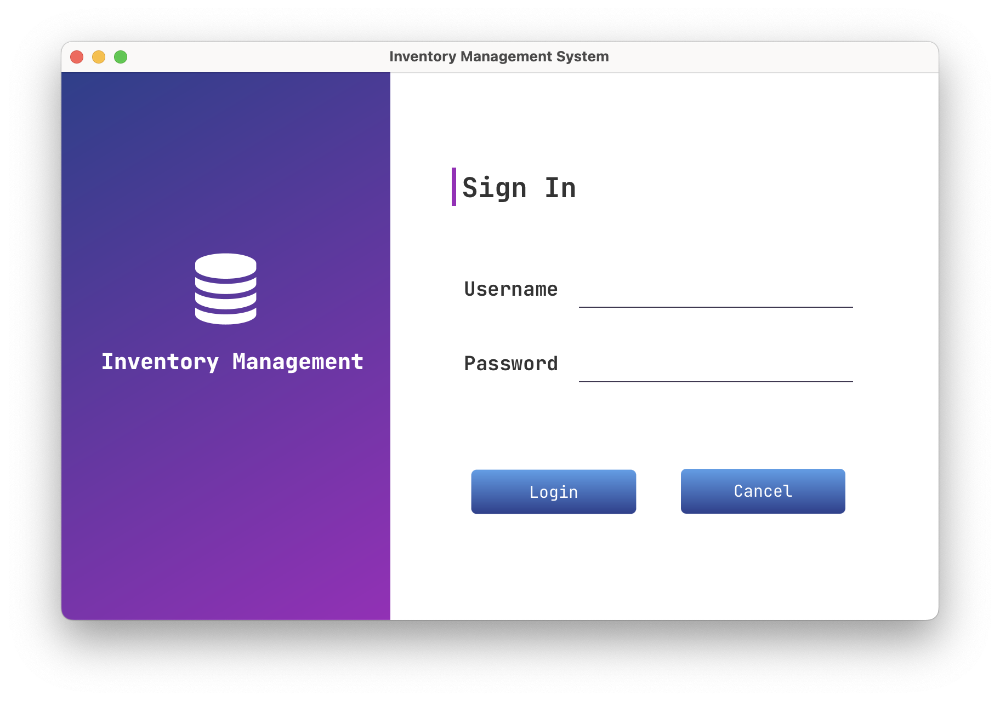
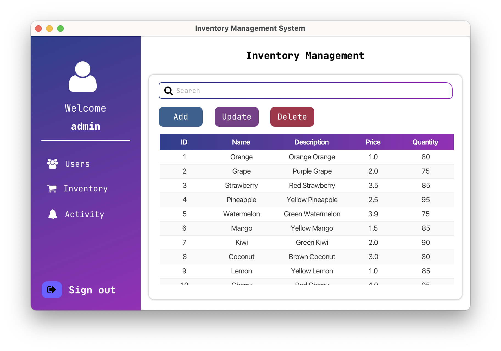
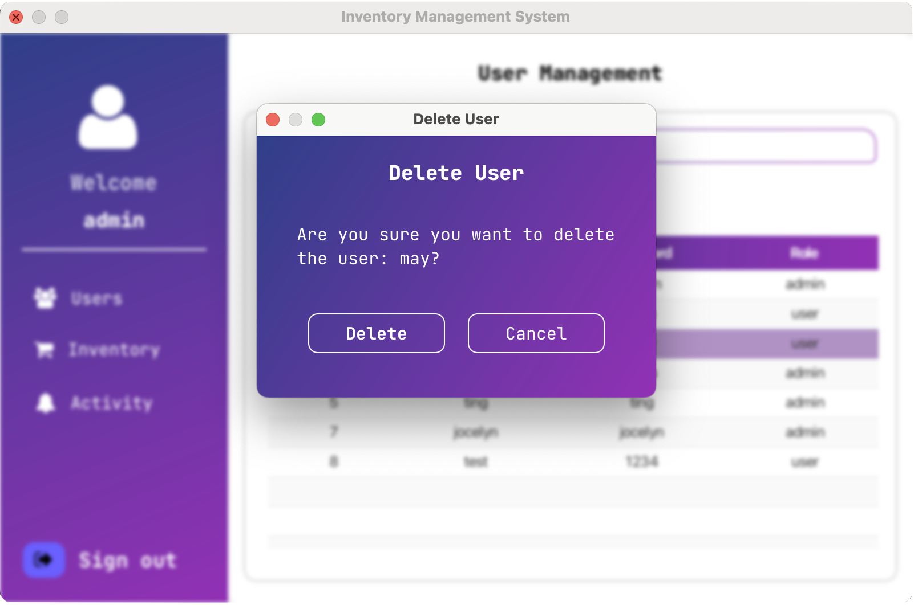
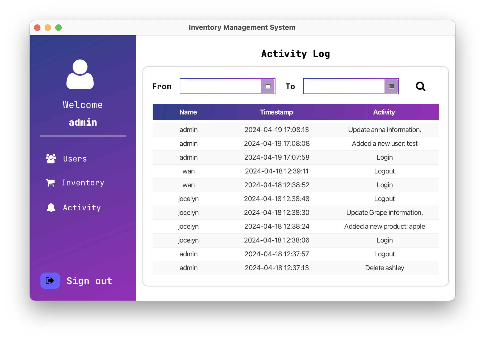
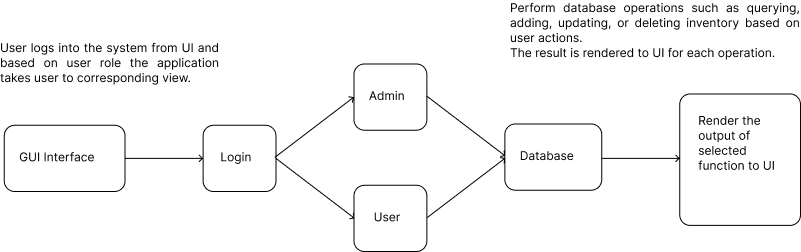

## Purpose and Scope Statement

The Inventory Management System is designed to help businesses effectively manage their product inventory. The system has two user roles: admin and user. The admin can perform various operations related to inventory management, user management and activity management. The user role is focused on viewing inventory product information. Supplier and sales order management are out of scope for this project. 

## Requirements Narrative

#### Admin Role

The admin can perform the following functions:

1. **User Management**:
   
   - Add new users (admin or user roles)
   - Update user information
   - Delete users
   - Search for users
2. **Inventory Management**:
   
   - Add new products to the inventory
   - Update product details in the inventory
   - Remove products from the inventory
   - Search for products in the inventory
3. **Activity Management:**
   - Search for activities within a selected date range
   - View a list of processes performed by admin users

#### User Role

The user can perform the following functions:

1. **Inventory Management**:
   - View inventory products detail information
   - Search inventory products detail information

## Objectives

#### Login

#### Admin

**Inventory Management**

**Users Management**

**Activity Management**

#### User

**View and search inventory products**

## Logic Specification

